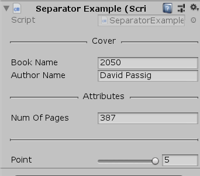

# Unity-Editor-Scripting

**Separator:** Separator for inspector.

</img><br>

```
[Separator("")] : Blank attribute, draws a simple line in inspector.
[Separator("Cover")] : It draws a line to left and right side of the "Cover".
```
